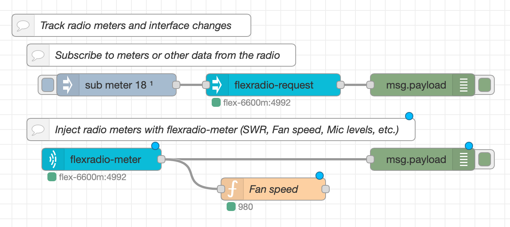

# FlexRadio 6xxx NodeRed Nodes

This repository provides a number of [NodeRed](https://nodered.org) nodes to 
interact with [FlexRadio 6xxx](http://flexradio.com) series software defined
and network attached radios.

**NOTE**: This repository is a work in progress. Expect things to change from one release to the next as it is developed.

The nodes in this collection are as follows:

- `flexradio-request` node to send commands to a radio (and get responses)
- `flexradio-message` node that injects messages and status from a radio into the flow
- `flexradio-meter` node that injects meter data from a radio (NOT WORKING)
- `flexradio-radio` configuration node that manages communication with radios
- `flexradio-discovery` node that injects radio discovery messages into the flow

The following support libraries are dependencies of these NodeRed nodes. They should be automatically installed when you install the `node-red-contrib-flexradio` nodes. They are contained in the same source repository and listed here for completeness sake.

- [VITA-49 datagram encoder/decoder library](https://github.com/stephenhouser/node-red-contrib-flexradio/packages/vita49-js)
- [FlexRadio 6xxx discovery message encoder/decoder](https://github.com/stephenhouser/node-red-contrib-flexradio/packages/flexradio-js)

## Using these nodes in your flows

The [example](example) directory has the example flows shown below. You can install this flow in your Node Red instance, but you will have to change the radio address to make them work.

The `flexradio-request` node is most likely the first node you will use. It allows you to send requests (or commands if you like) to a radio. You first need to configure the radio connection within the node after you add it to your flow. This radio configuration will be shared by other nodes in your flows, so you should only have to set it up once.

Once you have a `flexradio-request` node in your flow, you can send a request to your radio and see the response. Add an inject node with the payload `info` and a debug node at the other end to see the response from the radio. When you run the flow you should get an object in the debug window with all your radio parameters. In the above example, we send `sub meter 18` to the radio to subscribe to updates on the main fan speed.

You are now ready to look through the [FlexRadio Wiki](http://wiki.flexradio.com/index.php?title=SmartSDR_TCP/IP_API#SmartSDR_TCP.2FIP_Commands) and start sending other requests to your radio. There is a lot you can do with just this simple flow. Try `ant list`, or the more complex `audio client 0 slice 0 gain 20`.

The next step is to start getting some real-time information out of your radio. There are two ways the radio reports this information as it operates and two nodes that get that information into your flows; the `flexradio-message` node and the `flexradio-meter` node. The easier of the two is `flexradio-message`.

The `flexradio-message` will grab status reports and updates from the radio and inject them into your flows. With this node you can see information like `transmit/band/#` which will report (among other things) the RF power being used for transmitting. Note the format of the *topic* in that last sentence. These nodes use the same format that MQTT uses for subscribing to topics when we want to monitor events from the radio. This one in particular is looking for a `transmit` on a `band` where that band is *any* band (the `#`). NOTE: To get RF power updates this way, you need to have a station connected to the radio and first issue a `sub client all` request to your radio.

You cah use the topic `#` or an empty topic to have the `flexradio-message` node inject *all* the status messages from the radio into your flow. This is a great way to learn and understand what your radio is sending and what you can act upon.

The other node for getting data out of your radio is the `flexradio-meter` node. This node will generate a *lot* more data into your flow and can easily generate *too much* data if not used carefully. This node allows the *real-time meter data* from the radio to be injected into the flow. These are data like the SWR while transmitting, the actual forward power, and the system temperature. You can put a `flexradio-meter` node into your flow and configure it much like the `flexradio-messages` node; with a radio and a topic.

The `flexradio-meter` node will not get any data until you tell your radio to start sending those meter data to it. Start with a `meter list` request to get the list of meters available. Make a note of the meter number that you want. Then you can tell the radio to start sending them to your flow with a `sub meter` request. You can also use `sub meter all` to send all the meter data if you like. Then you can use the *topic* of the `flexradio-meter` node to filter what you want where.

## Issues

Please use the [GitHub issues](https://github.com/stephenhouser/node-red-contrib-flexradio/issues) tab above to report problems with these nodes. Be as precise as you can with the problem and include any log data you may have captured.