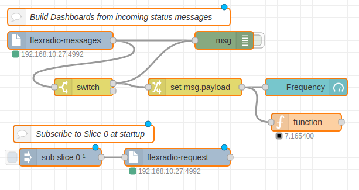
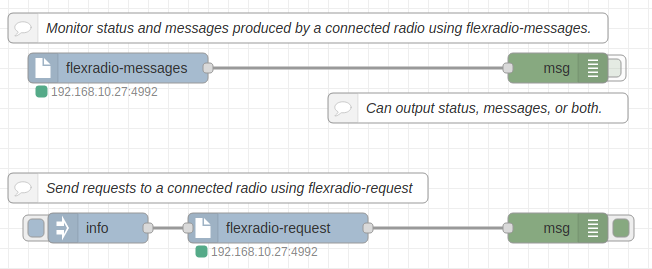

# FlexRadio 6xxx NodeRed Nodes

This repository provides a number of [NodeRed](https://nodered.org) nodes to 
interact with [FlexRadio 6xxx](http://flexradio.com) series software defined
and network attached radios.



**NOTE**: This repository is a work in progress. These nodes and code may not work at all for anyone but me at the moment.

The nodes in this collection are as follows:

- `flexradio-discovery` node that injects radio discovery messages into the flow
- `flexradio-request` node to send commands to a radio (and get responses)
- `flexradio-message` node that injects messages and status from a radio into the flow
- `flexradio-meter` node that injects meter data from a radio (NOT WORKING)
- `flexradio-subscription` node that subscribes to a radio topic and injects data about that topic from a radio (NOT WORKING)
- `VITA-49` decoder node that will decode the raw data from a VITA-49 UDP packet
- `flexradio-server` configuration node that manages communication with radios

The following support libraries are dependencies of these NodeRed nodes. They should be automatically installed when you install the `node-red-contrib-flexradio` nodes. They are listed here just for completeness sake.

- [VITA-49 datagram encoder/decoder library](https://github.com/stephenhouser/vita49-js)
- [FlexRadio 6xxx discovery message encoder/decoder](https://github.com/stephenhouser/flexradio-js)

## Some Details



The guts of these nodes are broken into three parts:

- Back-end libraries for managing the network connection to the radio. These are the dependencies, vita49-js and flexradio-js.
- A radio configuration node that uses the back-end libraries and manages a connection to a single radio. This also allows multiple other nodes to connect to a radio through the configuration node
- A collection of special purpose nodes for discovery, sending requests, and monitoring messages and status updates from the radio.

The nodes generate messages in the flow using the Nodered `topic` and `payload` as well as a few other message properties. Look at the help for each node for details. In general the `topic` will be the radio subsystem and the payload will be the data sent.

Some example status update messages:

* topic: `interlock`, payload: `{tx_client_handle:"0x00000000",state:"READY",reason:"",source:"",tx_allowed:"1",amplifier:""}`
* topic: `slice/0`, payload: `{RF_frequency:"7.163200",wide:"0",lock:"0"}`
* topic: `transmit`, payload: `{rfpower:"0",tunepower:"0",am_carrier_level:"100"}`

## Development Notes

Todo:

- [ ] Should `flexradio-meter` be different than `flexradio-message` or should there be just one node that injects any/all data regardless of source (TCP or UDP) and is able to filter by topic. Similar question about `flexradio-subscription`.

- [ ] Test cases and testing for nodes and packet decoding. Need to read up on Nodered test infrastructure.

- [ ] Documentation in the node help pages.

- [ ] Parse realtime meter data into messages that arrive on the client UDP port. These are the result of subscribing to `meter`s. What other data arrives over UDP?

- [ ] Parse `profile` messages that contain a `list` of `^` delimited profiles.

```
S6190EABE|profile mic list=Default^Default FHM-1^Default FHM-1 DX^Default FHM-2^Default FHM-2 DX^Default FHM-2 ESSB^Default FHM-3^Default FHM-3 DX^Default FHM-3 ESSB^Default HM-Pro^Default PR781^Default PR781 ESSB 3_2k^Default ProSet HC6^Inrad M629^Inrad M650^RadioSport DX M207^RadioSport DX M208^RadioSport DX M350-ADJ^RadioSport DX M360/EM56^RadioSport WIDE M207^RadioSport WIDE M208^RadioSport WIDE M350-ADJ^RadioSport WIDE M360/EM56^RTTYDefault^
```

- [ ] Flesh out the `flexradio-subscription` node to allow one-stop-shopping for subscribing and receiving messages from the radio. Ex, `sub meter 1` and all the meter messages for meter 1 should appear at the output of the node.